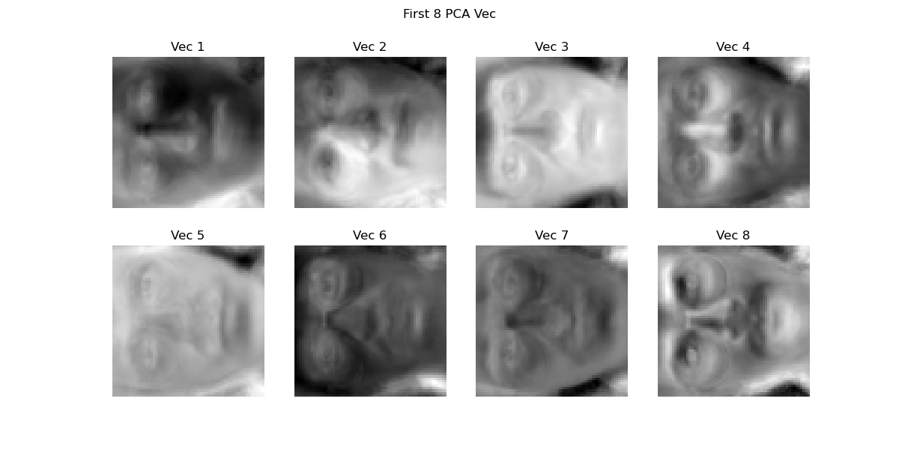
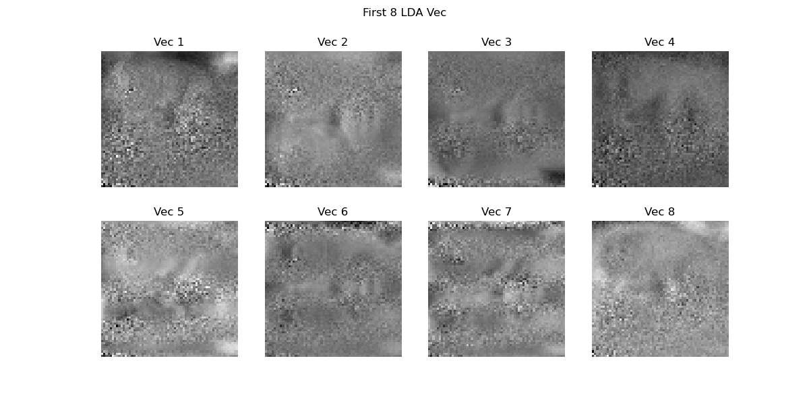
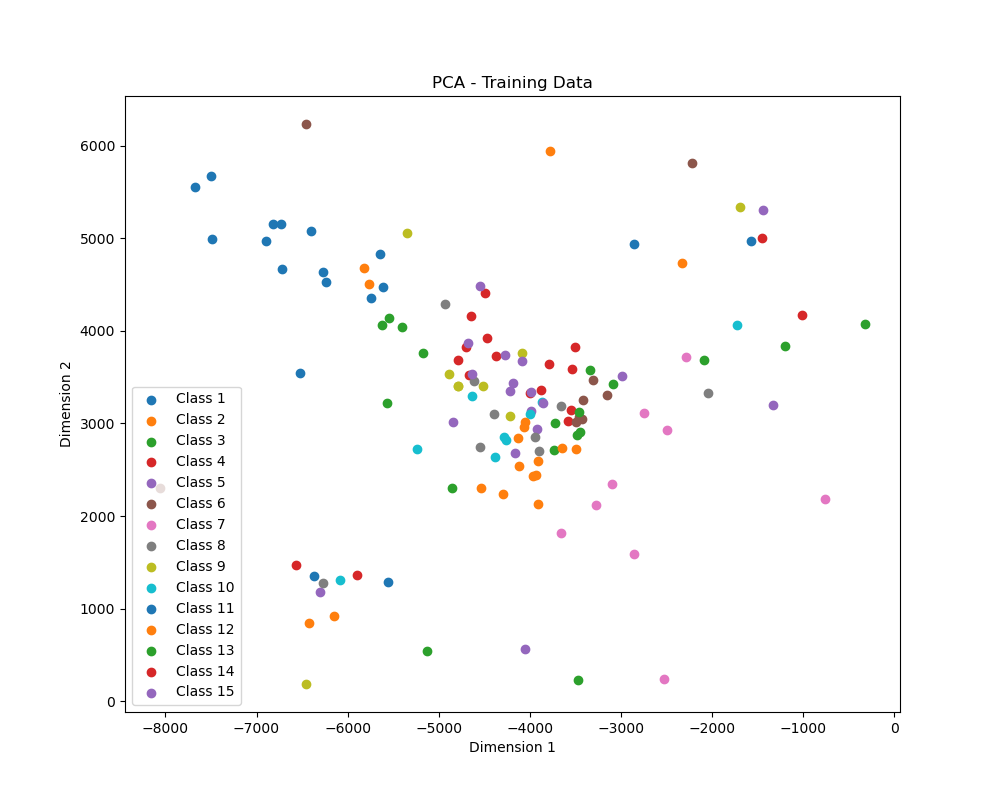
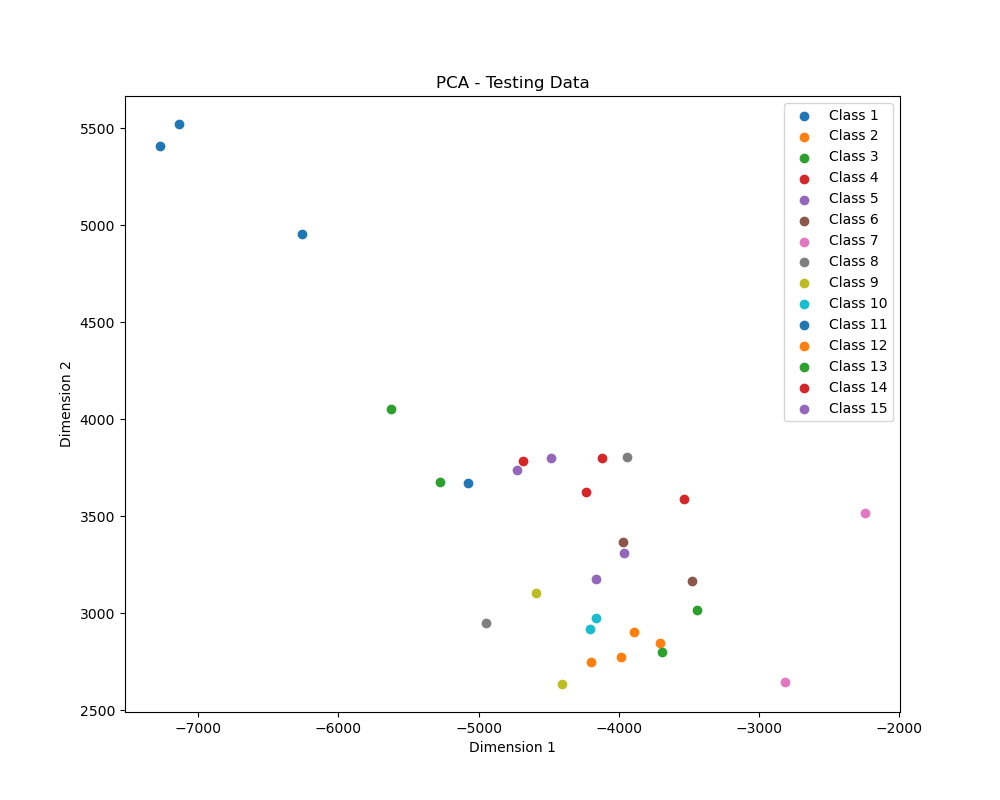
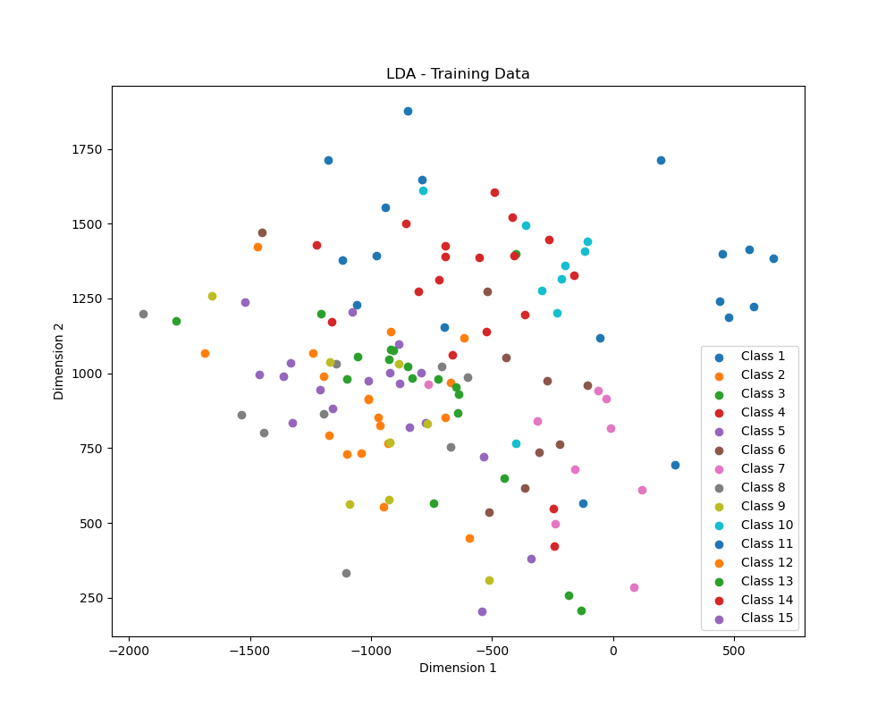
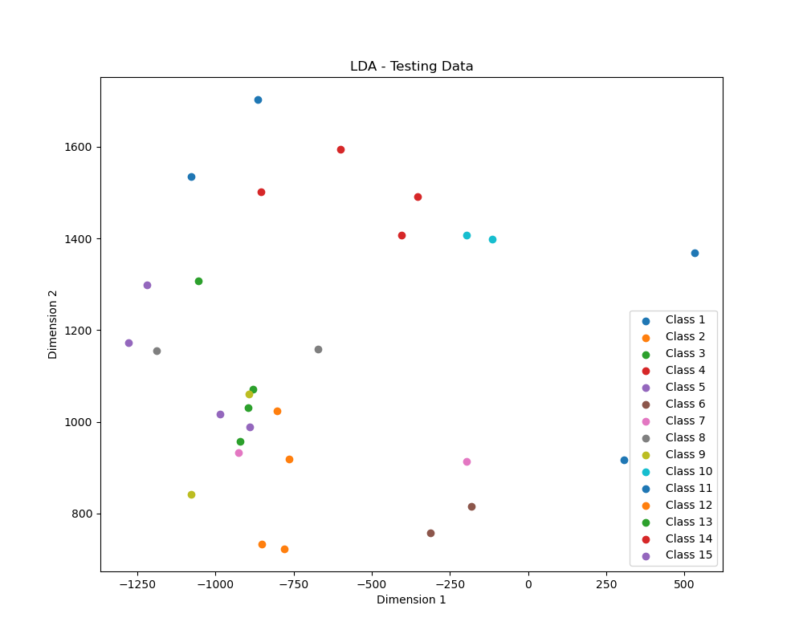

<h2 style="text-align:center;">模式识别作业2</h2>
<h4 style="text-align:center;">王子睿 21311590</h4>

## 实验目的
1. 熟悉并掌握 PCA、 LDA 的基本原理，并应用 PCA 和 LDA 实现数降维
2. 熟悉利用 KNN 分类器对样本进行分类

## 实验要求

1. 提交实验报告，要求有适当步骤说明和结果分析
2. 将代码和结果打包提交
3. 不能直接调用现有的库函数提供的 PCA、 LDA、 KNN 接口

## 实验内容
1. 自己实现 PCA 和 LDA 数据降维算法以及 KNN 分类器
2. 利用实现的两种降维算法对数据进行降维
3. 利用降维后的结果，用 KNN 进行训练和测试

## 实验过程
### 一． 实现 PCA 函数接口
实现一个你自己的 PCA 函数。 PCA 函数的主要流程是：先对计算数据的协方差矩阵，然后在对协方差矩阵进行 SVD 分解，得到对应的特征值和特征向量。

- 根据我的理解，SVD不能得到特征值和特征向量，奇异值跟特征值应该没有什么直接关系，这里指的应该是特征分解。
- `eigh` 可以分解厄米矩阵，而协方差矩阵是对称矩阵，所以可以分解。
- `eig` 似乎分解不出来，也可能是我电脑太慢了。

```py
import numpy as np

def pca(data, n_dim):
    """
    主成分分析(PCA)

    参数:
    data -- 输入数据，每行表示一个样本，每列表示一个特征
    n_dim -- 输出数据的维度，即要保留的主成分个数

    返回:
    w -- 投影矩阵，可以用于数据降维
    """

    # 中心化处理
    data = data - np.mean(data, axis=0)
    
    # 计算协方差矩阵
    cov = np.cov(data, rowvar=False)
    
    # 计算协方差矩阵的特征值和特征向量
    eig_values, eig_vectors = np.linalg.eigh(cov)
    
    # 对特征值进行排序，并选取前n_dim个特征向量
    sorted_indices = np.argsort(-eig_values)[:n_dim]
    w = eig_vectors[:, sorted_indices]
    
    return w


```
### 二． 实现 LDA 函数接口
实现一个你自己的 LDA 函数。 LDA 函数的主要流程是： 将样本数据按照类别进行分组，计算每个类别样本的均值向量。 计算类内散度矩阵与类间散度矩阵，利用二者得到投影矩阵，并用其进行数据降维。

```py
import numpy as np

def lda(data, target, n_dim=None):
    """
    线性判别分析(LDA)

    参数:
    data -- 输入数据，每行表示一个样本，每列表示一个特征
    target -- 样本标签，用于区分不同类别
    n_dim -- 输出数据的维度，默认为类别数，不能大于类别数

    返回:
    w -- 投影矩阵，可以用于对数据降维。
    """
    
    # 获取类别数
    clusters = np.unique(target)

    # 如果未指定输出维度，则设为类别数
    if n_dim is None:
        n_dim = len(clusters)

    # 检查输出维度是否合法
    if n_dim > len(clusters):
        raise ValueError("n_dim too large")

    # 计算类内散度矩阵Sw
    Sw = np.zeros((data.shape[1], data.shape[1]))
    for i in clusters:
        datai = data[target == i]
        datai = datai - datai.mean(axis=0)
        Sw += datai.T @ datai

    # 计算类间散度矩阵SB
    Sb = np.zeros((data.shape[1], data.shape[1]))
    u = data.mean(axis=0)
    for i in clusters:
        Ni = data[target == i].shape[0]
        ui = data[target == i].mean(axis=0)
        Sb += Ni * (ui - u).reshape(-1, 1) @ (ui - u).reshape(1, -1)

    # 计算投影矩阵w
    S = np.linalg.inv(Sw) @ Sb
    eig_values, eig_vectors = np.linalg.eigh(S)
    
    sorted_indices = np.argsort(-eig_values)[:n_dim]
    w = eig_vectors[:, sorted_indices]
    return w

```
### 三． 利用数据降维算法对输入数据进行降维

1. 只用训练集数据来学习 PCA 和 LDA 算法中的投影矩阵，并分别将两个方法相应的前 8 个特征向量变换回原来图像的大小进行显示。



 - 可以看出还是有一些人样的，PCA跟调库是基本一样的，LDA看上去差点比较远。
2. 然后对训练和测试数据用 PCA 和 LDA 分别进行数据降维（使用所学习的投影矩阵） 。
```py
pca_2d = pca(train_data,2)

train_data_pca_2d = train_data @ pca_2d
test_data_pca_2d = test_data @ pca_2d

lda_2d = lda(train_data, train_label,2)

train_data_lda_2d = train_data @ lda_2d
test_data_lda_2d = test_data @ lda_2d
```

3. 最后对采取 reduced_dim=2，即降维到 2 维后的训练和测试数据进行可视化，展示降维的效果。






### 四． 利用 KNN 算法进行训练和测试
1. KNN
   - 朴素的实现，没有使用KD-tree 
```py
import numpy as np

class KNN:
    def __init__(self, k=3):
        # 初始化KNN分类器
        self.k = k

    def fit(self, X, y):
        # 训练模型
        self.date = X
        self.label = y

    def predict(self, X):
        # 预测新样本的类别
        y_pred = [self.single_predict(x) for x in X]
        return np.array(y_pred)

    def single_predict(self, x):
        # 预测单个样本的类别
        distances = [np.linalg.norm(x - x_) for x_ in self.date]
        ids = np.argsort(distances)[:self.k]
        labels = [self.label[i] for i in ids]
        return np.bincount(labels).argmax()
```

-|LDA_acc|PCA_acc
-|-|-
15|0.93|0.93
13|0.83|0.93
10|0.87|0.93
8|0.90|0.93
6|0.83|0.90
4|0.70|0.73
2|0.33|0.43

- **结论**
  - KNN在高维的情况下效果不稳定，维度高保留的大部分信息，但也可能会保留态度噪音。
  - 在训练样本大约有135个的情况下，维数大于8会比较好。